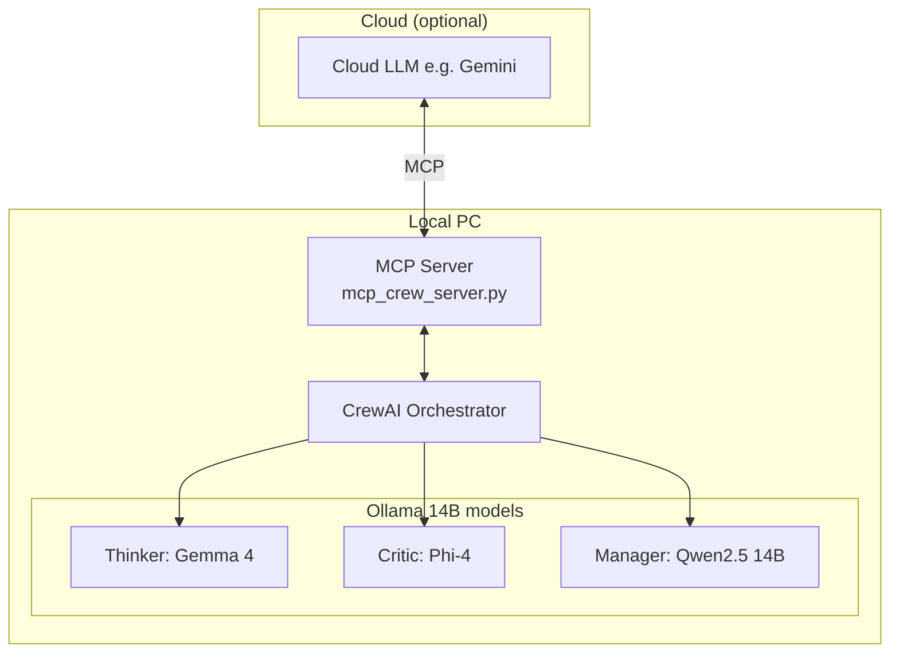

# HERA: Hybrid Edge-cloud Resource Allocation


> [日本語版はこちら](README_ja.md)

A local-first, multi-agent AI system built on [CrewAI](https://github.com/crewAIInc/crewAI) and [Ollama](https://ollama.com/).
Run powerful 14B-class models entirely on your own GPU  Eno cloud API required.
When you need it, plug in Gemini or any other cloud LLM with a single `.env` change.

---

## Why HERA?

Most AI workflows default to cloud APIs for every call. HERA flips that default:

- **Thinker** (Gemma 4)  Edecomposes tasks and writes first drafts locally
- **Critic** (Phi-4)  Ereviews and catches hallucinations locally
- **Manager** (Qwen2.5 14B)  Eorchestrates, validates, and escalates to cloud only when needed

The result: the expensive cloud token budget is spent only on work that actually needs it.

| Concern | HERA answer |
|---|---|
| API cost | Iterative thinking stays local |
| Privacy | Drafts never leave your machine |
| Quality | 3-agent cross-review catches errors |
| Flexibility | Swap any model in one line of `.env` |

---

## Key Features

- **HERA resource strategy**  Edynamic local/cloud routing per task
- **MCP server mode**  Eexpose the crew as a tool to Claude Desktop, Cursor, etc.
- **Centralized LLM config**  Eone `llms.yaml` controls every model; `.env` overrides per-run
- **32k context window**  E`num_ctx: 32768` applied to all Ollama calls via `extra_body`
- **Zero OpenAI dependency**  Efully offline by default; no `OPENAI_API_KEY` required

---

## Architecture



See [ARCHITECTURE.md](ARCHITECTURE.md) for details.

---

## Project Structure

```text
hera-crew/
├── .env.example                # Environment variable template
├── mcp_settings_example.json   # MCP client config example
├── mcp_crew_server.py          # MCP server entry point
├── requirements.txt
├── scripts/
━E  └── inspect_llm.py
├── tests/
━E  ├── test_delegation.py
━E  └── test_llm_syntax.py
└── src/hera_crew/
    ├── config/
    ━E  ├── agents.yaml         # Agent role definitions
    ━E  ├── llms.yaml           # Centralized model config
    ━E  └── tasks.yaml          # Task routing definitions
    ├── tools/
    ━E  └── antigravity_delegate.py
    ├── crew.py
    └── main.py
```

---

## Requirements

- Python 3.10  E3.13
- [Ollama](https://ollama.com/) installed and running
- GPU recommended (VRAM 16 GB+ for all 14B models simultaneously)

---

## Setup

```bash
git clone https://github.com/ryohryp/hera-crew.git
cd hera-crew

python -m venv venv
source venv/bin/activate        # Windows: venv\Scripts\activate

pip install -r requirements.txt

cp .env.example .env
# Edit .env if needed
```

Pull the required Ollama models:

```bash
# HERA crew (main.py)
ollama pull qwen2.5:14b         # Manager  Emust support function calling
ollama pull gemma4:26b       # Thinker
ollama pull phi4:latest         # Critic

# MCP server (mcp_crew_server.py)
ollama pull qwen2.5-coder:14b   # Specialist / Coder
ollama pull deepseek-r1:14b     # Reviewer
```

---

## Usage

### Standalone CLI

```bash
python src/hera_crew/main.py
```

Enter your task at the prompt. The crew runs sequentially:
Thinker ↁECritic ↁEManager ↁEfinal output.

### MCP Server

```bash
python mcp_crew_server.py
```

Add to your MCP client config (e.g. Claude Desktop `claude_desktop_config.json`):

```json
{
  "mcpServers": {
    "hera-crew": {
      "command": "/absolute/path/to/venv/Scripts/python",
      "args": ["/absolute/path/to/mcp_crew_server.py"]
    }
  }
}
```

This exposes a `delegate_task(task_description)` tool that offloads complex work to your local agent team.

### Quick test

```bash
python tests/test_delegation.py
```

---

## Example Execution

HERA demonstrates sophisticated reasoning in Japanese, even when running entirely on local 14B models.

**Request:**
> Implement a satellite orbit simulator based on astrophysics, considering general relativity. Use the Runge-Kutta method for numerical integration and consider acceleration with PyTorch.

**Execution Trace (Summary):**

```text
╭──────────────────────────────────────────────────── 🤁EAgent Started ────────────────────────────────────────────────────╮
━E Agent: Bridge Thinker (Gemma 4)                                                                                         ━E━E Task: Decompose the request into detailed subtasks (Manifests) in Japanese.                                             ━E╰──────────────────────────────────────────────────────────────────────────────────────────────────────────────────────────╯

╭───────────────────────────────────────────────── ✁EAgent Final Answer ──────────────────────────────────────────────────╮
━E Final Answer: (Decomposition example in Japanese)                                                                       ━E━E 1. Define basic physical models (constants.py): G, c, earth_mass, etc.                                                  ━E━E 2. Relativistic formula implementation (gravity_potential.py): Schwarzschild potential.                                  ━E━E 3. RK4 Implementation (rk4.py): 4th-order Runge-Kutta motion integrator.                                                ━E━E ... (omitted)                                                                                                           ━E╰──────────────────────────────────────────────────────────────────────────────────────────────────────────────────────────╯

╭──────────────────────────────────────────────────── 🤁EAgent Started ────────────────────────────────────────────────────╮
━E Agent: The Quality Critic (Phi-4)                                                                                       ━E━E Task: Evaluate if subtasks are solvable locally or require Cloud escalation (Antigravity).                              ━E╰──────────────────────────────────────────────────────────────────────────────────────────────────────────────────────────╯

╭───────────────────────────────────────────────── ✁EAgent Final Answer ──────────────────────────────────────────────────╮
━E Final Answer:                                                                                                           ━E━E - Subtasks 1, 4, 6: LOCAL (Safe for Gemma 4 to handle)                                                                  ━E━E - Subtasks 2, 3, 5: FALLBACK (Recommended delegation due to complex physics/RK4 requirements)                            ━E╰──────────────────────────────────────────────────────────────────────────────────────────────────────────────────────────╯
```

HERA doesn't just generate answers; it **critically assesses its own capabilities** and routes tasks to the most appropriate resource (Local Edge vs. Cloud Expert).

[See full log here](logs/sample_execution.log)

---

## Configuration

### Swap models via `llms.yaml`

```yaml
hera:
  manager:
    model: "ollama/qwen2.5:14b"   # ollama/ prefix required
    timeout: 300
    num_ctx: 32768
  thinker:
    model: "ollama/gemma4:26b"
  critic:
    model: "ollama/phi4:latest"
```

### Override per-run via `.env`

```ini
MANAGER_MODEL=ollama/qwen2.5:14b
THINKER_MODEL=ollama/gemma4:26b
CRITIC_MODEL=ollama/phi4:latest

# Switch to cloud:
# MANAGER_MODEL=gemini/gemini-1.5-pro
# GOOGLE_API_KEY=your_key
```

> **Note:** Always use the `ollama/` prefix for Ollama models. Without it, LiteLLM routes the request to OpenAI and fails with an auth or connection error.
> **Note:** The Manager must use a function-calling-capable model (like `qwen2.5:14b`). Note that `deepseek-r1` does not support tool calling via Ollama.

---

## Troubleshooting

**`Failed to connect to OpenAI API` (Connection error)**
LiteLLM is trying to reach OpenAI for model cost data or validation. Ensure your `.env` has these three flags:
- `OPENAI_API_KEY=NA`
- `LITELLM_LOCAL_MODEL_COST_MAP=True`
- `LITELLM_DROP_PARAMS=True`

**`invalid_api_key` error**
Ensure `OPENAI_API_KEY=NA` is set in your `.env`.

**`404 Model Not Found` error**
Check your model names in `llms.yaml` or `.env`. They must exactly match the output of `ollama list` and must include the `ollama/` prefix.

**Model "forgets" in long conversations**
Verify the `num_ctx` in `llms.yaml`. It is set to `32768` by default for all local models.

---

## License

[MIT](LICENSE)

---

*HERA: Hybrid Edge-cloud Resource Allocation for Autonomous Multi-Agent Development.*
