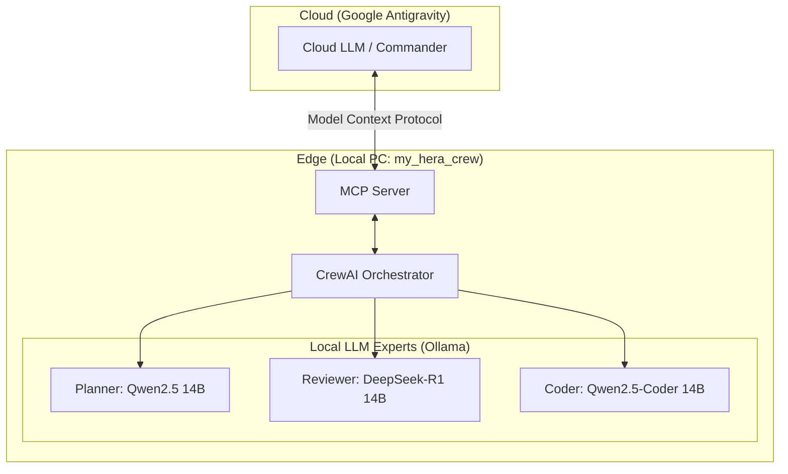

# HERA: Hybrid Edge-cloud Resource Allocation Multi-Agent System


## 1. 概要 (System Overview)

本システムは、**HERA（Hybrid Edge-cloud Resource Allocation）戦略**に基づき、クラウドLLMとローカルLLM（Ollama）を動的に使い分ける自律型AIマルチエージェントチームです。

ローカルPCのGPUパワーを最大限に活用し、コスト効率と高度な推論能力を両立させます。CrewAI フレームワークを基盤とし、MCPサーバーとしても動作可能です。

## 2. システムの特徴 (Key Features)

*   **HERA 戦略によるリソース最適化**: 全てのタスクをクラウドに投げるのではなく、初期の分析やドラフト作成をローカル（Ollama）で行い、最終的な統合や高度な推論のみをクラウド（Gemini 等）または強力なローカルモデル（DeepSeek-R1 等）に割り振ります。
*   **APIコストの劇的な削減**: 試行錯誤の段階（Thinker/Critic のループ）をローカルで完結させるため、クラウドLLMのトークン消費を最小限に抑えられます。
*   **マルチエージェントによる品質担保**: 単一のLLMではなく、役割の異なる3つのエージェント（Thinker, Critic, Manager）が相互に検証・補完し合うことで、ハルシネーションの抑制と出力品質の向上を実現しています。
*   **プライバシーとセキュリティ**: 重要なデータを含む初期調査やコードの下書きをローカル環境で処理できるため、不用意なデータ流出を抑えられます。
*   **拡張性の高い MCP 対応**: 単体で動くだけでなく、MCPサーバーとして起動することで、Claude Desktop や Cursor などの使い慣れたエディタから「高度なタスク解決ツール」として呼び出すことができます。

## 3. 想定利用シーン (Target Audience & Use Cases)

### ターゲットユーザー
*   **ローカルGPU（VRAM 16GB以上推奨）を持つ開発者**: 自宅のPCリソースを腐らせず、賢く開発に活用したい方。
*   **APIコストを抑えたいプロフェッショナル**: 頻繁にAIとペアプログラミングを行うが、コストパフォーマンスも重視したい方。
*   **プライバシー重視の開発者**: 未公開のソースコードや機密情報を含む調査を、可能な限り手元の環境で処理したい方。

### 具体的な利用シーン
*   **複雑なプログラミングタスクの自動化**: 「ディレクトリ構成の設計 → 各ファイルの雛形作成 → ロジックの検証」といった一連の流れを自律的に実行させたい場合。
*   **技術調査とドキュメント作成**: 膨大なリサーチが必要なタスクを Thinker に分散させ、Manager に要約させることで、リサーチ時間を短縮したい場合。
*   **AIエディタの機能拡張**: Cursor や Claude 等で、「この機能の実装プランを作って実行して」と指示した際に、HERA がバックグラウンドで緻密な検討を行い、完成度の高いコードを提案する。

## 4. システムアーキテクチャ (System Architecture)

タスクの性質に応じて、以下のエージェントが連携します：

1.  **Orchestrator / Manager** (例: DeepSeek-R1):
    *   全体計画の策定、タスクの委任、最終成果物の検証。
    *   高度な推論が必要な場合や進行度の後半（Late stage）で稼働。
2.  **Bridge / Thinker** (例: Gemma 3):
    *   タスクの細分化、翻訳、初期コードのドラフト作成、一次調査。
    *   クラウドAPIを消費せず、ローカル環境で迅速に思考を実行。
3.  **The Critic** (例: Phi-4):
    *   Thinkerの出力を厳格にレビューし、ハルシネーションを防止。
    *   ローカルでの「収束」が困難な場合、Managerへのフォールバックを推奨。

### 構成図 (Architecture Diagram)



## 5. ディレクトリ構成 (Project Structure)

```text
my_hera_crew/
├── .env.example                # 環境変数テンプレート
├── .gitignore                  # Git除外設定
├── LICENSE                     # MITライセンス
├── README.md                   # 本ドキュメント
├── requirements.txt            # 依存ライブラリ
├── mcp_crew_server.py          # MCPサーバー（外部ツール連携用）
├── test_delegation.py          # 委譲テストスクリプト
└── src/
    └── my_hera_crew/
        ├── __init__.py
        ├── config/
        │   ├── agents.yaml     # エージェント役割定義
        │   ├── llms.yaml       # LLMモデル設定（集中管理）
        │   └── tasks.yaml      # タスク・ルーティング定義
        ├── tools/
        │   └── antigravity_delegate.py  # 外部エージェント委譲ツール
        ├── crew.py             # CrewAI初期化 & LLM設定
        └── main.py             # 実行用エントリーポイント
```

## 6. セットアップ (Setup)

### 必須要件

*   Python 3.10 ~ 3.13
*   [Ollama](https://ollama.com/) がインストールされていること
*   GPU（推奨: VRAM 16GB以上）

### インストール

```bash
# リポジトリのクローン
git clone https://github.com/ryohryp/my_hera_crew.git
cd my_hera_crew

# 仮想環境のセットアップ
python -m venv venv
source venv/bin/activate      # Linux/macOS
# venv\Scripts\activate       # Windows

# 依存関係のインストール
pip install -r requirements.txt

# 環境変数の設定
cp .env.example .env
# 必要に応じて .env を編集
```

### ローカルモデルの準備

Ollamaで必要なモデルを取得しておきます（`llms.yaml` の設定に従って変更可能）。

```bash
ollama pull deepseek-r1:14b
ollama pull gemma3:latest
ollama pull phi4:latest
```

## 7. 実行方法 (Usage)

本システムは、CLIから直接実行する**スタンドアロンモード**と、他のクライアント（Claude DesktopやCursorなど）からタスク委譲ツールとして呼び出せる**MCPサーバーモード**の2種類の実行方法を提供しています。

### 1. スタンドアロン実行 (CLI モード)

ローカルで直接スクリプトを実行し、インタラクティブにタスク内容を入力して処理させる方法です。

```bash
python src/my_hera_crew/main.py
```

**実行フロー:**
1. スクリプトを起動するとプロンプト（`Please enter your development task`）が表示されます。
2. 実行したいタスク（例: 「Pythonで簡易的なスクレイピングツールを作成して」）を入力します。
3. まず **Thinker (Gemma 3)** がタスクを小さなステップに細分化し、技術的なドラフトを作成します。
4. **Critic (Phi-4)** がその内容を評価し、破綻がないかチェックします。
5. 最後に **Manager (DeepSeek-R1)** が全体の統合と検証を行い、ターミナル上に最終的な成果物を出力します。

---

### 2. MCPサーバーとして使用 (外部ツール連携)

本システムを [Model Context Protocol (MCP)](https://modelcontextprotocol.io/) サーバーとして起動し、外部のAIアシスタントに高度なタスク解決ツールを提供する方法です。

```bash
# FastMCP を使用し、標準入出力 (stdio) 経由でサーバーとして待機します
python mcp_crew_server.py
```

**利用できるようになるツール:**
*   `delegate_task(task_description: str)`
    *   **概要:** 与えられたタスクを、「分析（Analyst）」「実行（Specialist）」「レビュー（Reviewer）」の3段階からなるエージェントチームに丸投げして処理させます。
    *   **用途:** フロントのAIが行うのが難しい複雑なコード生成や調査を、ローカルのLLMチームにオフロードしたい場合に使用します。

**MCPクライアント（Claude Desktop等）の設定例:**
```json
{
  "mcpServers": {
    "my_hera_crew": {
      "command": "絶対パス/my_hera_crew/venv/Scripts/python",
      "args": [
        "絶対パス/my_hera_crew/mcp_crew_server.py"
      ]
    }
  }
}
```

---

### 3. テストスクリプトの実行

エージェントの連携が正しく行われるか手っ取り早く確認したい場合は、同梱されているテストスクリプトを実行してください。固定のタスクが実行されます。

```bash
python test_delegation.py
```
## 8. 設定のカスタマイズ (Customization)

### ローカルモデルの変更方法

本システムでは、用途に合わせて使用するLLMモデルを柔軟に変更できます。変更方法は「設定ファイルによる一元管理」と「環境変数によるクイックな上書き」の2種類があります。

#### A. 設定ファイル (`src/my_hera_crew/config/llms.yaml`) を編集
プロジェクト全体で使用するデフォルトモデルを変更する場合に適しています。

```yaml
# hera: メインの実行（main.py）で使用されるモデル
# general: MCPサーバー（mcp_crew_server.py）で使用されるモデル
hera:
  manager:
    model: "ollama_chat/deepseek-r1:14b"  # Ollamaのモデル名を指定
    timeout: 300
  thinker:
    model: "ollama_chat/gemma3:latest"
    timeout: 60
```

#### B. 環境変数 (`.env`) で上書き
特定の実行時のみモデルを切り替えたい、あるいはAPIキーを必要とするクラウドLLM（Gemini等）を使用したい場合に適しています。

```ini
# .env ファイルに記述することで llms.yaml の設定よりも優先されます
MANAGER_MODEL=deepseek-r1:32b
THINKER_MODEL=llama3.1:8b
# クラウドモデルへの切り替え例
# MANAGER_MODEL=gemini/gemini-1.5-pro
```

> [!TIP]
> **モデル名の指定ルール**
> - Ollamaモデルを使用する場合: `ollama_chat/モデル名` または `ollama/モデル名` と記述します。
> - クラウドモデルを使用する場合: `gemini/gemini-1.5-flash` のように `プロバイダー名/モデル名` で記述し、対応するAPIキー（`GOOGLE_API_KEY` 等）を `.env` に設定してください。

### パフォーマンス最適化

*   **並列実行設定**: `OLLAMA_NUM_PARALLEL` を環境変数で設定することで、Ollamaの並列処理数を調整できます（デフォルト: 4）。
*   **タイムアウト調整**: `llms.yaml` の `timeout` 値を増やすことで、推論に時間がかかる巨大なモデル（DeepSeek-R1等）のタイムアウトエラーを回避できます。
*   **GPUの使用**: Ollama側で適切にGPUが認識されていれば、特別な設定なしで高速な推論が可能です。

## 9. ライセンス (License)

本プロジェクトは [MIT License](LICENSE) の下で公開されています。

---

**HERA: Hybrid Edge-cloud Resource Allocation for Autonomous Multi-Agent Development.**
