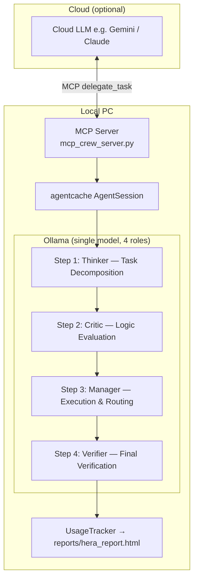

# HERA: Hybrid Edge-cloud Resource Allocation


> [日本語版はこちら](README_ja.md)

A local-first, multi-agent AI system built on [agentcache](https://github.com/eyurtsev/agentcache) and [Ollama](https://ollama.com/).
Run powerful models entirely on your own GPU — no cloud API required.
When you need it, plug in any cloud LLM with a single `.env` change.

---

## Why HERA?

Most AI workflows default to cloud APIs for every call. HERA flips that default:

- **Thinker** — decomposes tasks and writes first drafts locally
- **Critic** — reviews and catches logical errors locally
- **Manager** — executes and routes, escalating to cloud only when needed
- **Verifier** — confirms the final result matches the original request

The result: the expensive cloud token budget is spent only on work that actually needs it.

| Concern | HERA answer |
|---|---|
| API cost | Iterative thinking stays local |
| Privacy | Drafts never leave your machine |
| Quality | 4-stage cross-review catches errors |
| Flexibility | Swap any model in one line of `.env` |

---

## Key Features

- **HERA resource strategy** — dynamic local/cloud routing per task
- **4-stage pipeline** — Thinker → Critic → Manager → Verifier with real-time terminal UI
- **MCP server mode** — expose the crew as a tool to Claude Desktop, Cursor, etc.
- **Centralized LLM config** — one `llms.yaml` controls every model; `.env` overrides per-run
- **Usage tracking & HTML report** — full cost comparison (local vs. cloud) saved to `reports/hera_report.html`
- **32k context window** — `num_ctx: 32768` applied to all Ollama calls
- **Zero OpenAI dependency** — fully offline by default; no `OPENAI_API_KEY` required

---

## Architecture



See [ARCHITECTURE.md](ARCHITECTURE.md) for details.

---

## Project Structure

```text
hera-crew/
├── .env.example                # Environment variable template
├── mcp_settings_example.json   # MCP client config example
├── mcp_crew_server.py          # MCP server entry point
├── requirements.txt
├── reports/
│   ├── hera_report.html        # HTML cost report (overwritten each run)
│   └── history.jsonl           # Run history
├── scripts/
│   └── inspect_llm.py
├── tests/
│   ├── test_delegation.py
│   └── test_llm_syntax.py
└── src/hera_crew/
    ├── config/
    │   ├── agents.yaml         # Agent role definitions
    │   ├── llms.yaml           # Centralized model config
    │   └── tasks.yaml          # Task routing definitions
    ├── tools/
    │   └── antigravity_delegate.py
    ├── utils/
    │   ├── env_setup.py        # Environment initialization
    │   ├── llm_factory.py      # LLM config builder
    │   └── usage_tracker.py    # Token usage & cost tracking
    ├── crew.py                 # HeraCrew — 4-stage pipeline + HeraUI
    ├── main.py                 # Standalone CLI entry point
    └── orbital_simulator.py    # Example: GR-corrected orbit simulator (RK4 + PyTorch)
```

---

## Requirements

- Python 3.10–3.13
- [Ollama](https://ollama.com/) installed and running
- GPU recommended (VRAM 8 GB+ for a 14B model)

---

## Setup

```bash
git clone https://github.com/ryohryp/hera-crew.git
cd hera-crew

python -m venv venv
source venv/bin/activate        # Windows: venv\Scripts\activate

pip install -r requirements.txt

cp .env.example .env
# Edit .env if needed
```

Pull the required Ollama model:

```bash
# Main pipeline model (must support function calling)
ollama pull qwen2.5:14b
```

---

## Usage

### Standalone CLI

```bash
python src/hera_crew/main.py
```

Enter your task at the prompt. The crew runs the 4-stage pipeline with a real-time Rich terminal UI:
Thinker → Critic → Manager → Verifier → HTML report saved to `reports/hera_report.html`.

### MCP Server

```bash
python mcp_crew_server.py
```

Add to your MCP client config (e.g. Claude Desktop `claude_desktop_config.json`):

```json
{
  "mcpServers": {
    "hera-crew": {
      "command": "/absolute/path/to/venv/Scripts/python",
      "args": ["/absolute/path/to/mcp_crew_server.py"]
    }
  }
}
```

This exposes a `delegate_task` tool. The orchestrating LLM (e.g. Claude) calls it like this:

```
delegate_task(
    task_description="<full task with file paths, goals, constraints>",
    orchestrator_input_tokens=<input tokens so far>,
    orchestrator_output_tokens=<output tokens so far>,
    orchestrator_model="claude-sonnet-4-6"
)
```

Passing token counts lets HERA render a full local-vs-cloud cost comparison in the HTML report.

> **Note for Claude Code users:** Claude Code cannot expose its own token counts to MCP tools.
> Leave `orchestrator_input_tokens` / `orchestrator_output_tokens` unset (default 0).
> The report will show time-based pipeline metrics instead of cost comparison.

### Quick test

```bash
python tests/test_delegation.py
```

---

## Example Execution

HERA demonstrates sophisticated reasoning in Japanese, even when running entirely on local models.

**Request:**
> Implement a satellite orbit simulator based on astrophysics, considering general relativity. Use the Runge-Kutta method for numerical integration and consider acceleration with PyTorch.

**Real-time terminal UI (HeraUI):**

```
╭─────────────── 🤖 HERA Multi-Agent System ───────────────╮
│ Model: ollama/qwen2.5:14b                                 │
├───┬──────────────────────┬─────────┬───────────────────────┤
│   │ Task                 │ Agent   │ Time                  │
├───┼──────────────────────┼─────────┼───────────────────────┤
│ ✅│ Task Decomposition   │ Thinker │ 12.3s                 │
│ ✅│ Logic Evaluation     │ Critic  │ 8.7s                  │
│ ✅│ Execution & Routing  │ Manager │ 45.2s                 │
│ ⏳│ Final Verification   │ Manager │ 6.1s                  │
╰───┴──────────────────────┴─────────┴───────────────────────╯
```

HERA doesn't just generate answers; it **critically assesses its own capabilities** and routes tasks to the most appropriate resource (local edge vs. cloud).

---

## Configuration

### Swap models via `llms.yaml`

```yaml
hera:
  manager:
    model: "ollama/qwen2.5:14b"   # ollama/ prefix required
    timeout: 300
    num_ctx: 32768
```

### Override per-run via `.env`

```ini
MANAGER_MODEL=ollama/qwen2.5:14b

# Switch to cloud:
# MANAGER_MODEL=gemini/gemini-1.5-pro
# GOOGLE_API_KEY=your_key
```

> **Note:** Always use the `ollama/` prefix for Ollama models. Without it, LiteLLM routes the request to OpenAI and fails with an auth or connection error.
> **Note:** The Manager must use a function-calling-capable model (like `qwen2.5:14b`). Note that `deepseek-r1` does not support tool calling via Ollama.

---

## Usage Report

After each run, an HTML report is saved to `reports/hera_report.html`. It shows:

- Tokens and cost per pipeline step
- Total local cost vs. equivalent cloud cost
- Delegation count (calls to the cloud via `antigravity_delegate`)
- Run history across sessions (`reports/history.jsonl`)

---

## Troubleshooting

**`Failed to connect to OpenAI API` (Connection error)**
LiteLLM is trying to reach OpenAI for model cost data. Ensure your `.env` has these flags:
- `OPENAI_API_KEY=NA`
- `LITELLM_LOCAL_MODEL_COST_MAP=True`
- `LITELLM_DROP_PARAMS=True`

**`invalid_api_key` error**
Ensure `OPENAI_API_KEY=NA` is set in your `.env`.

**`404 Model Not Found` error**
Check your model name in `llms.yaml` or `.env`. It must exactly match `ollama list` output and must include the `ollama/` prefix.

**Model "forgets" in long conversations**
Verify the `num_ctx` in `llms.yaml`. It is set to `32768` by default.

---

## License

[MIT](LICENSE)

---

*HERA: Hybrid Edge-cloud Resource Allocation for Autonomous Multi-Agent Development.*
