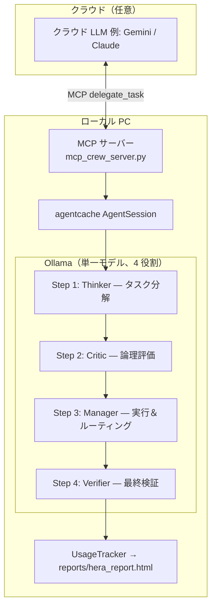

# HERA: Hybrid Edge-cloud Resource Allocation


> [English version here](README.md)

[agentcache](https://github.com/eyurtsev/agentcache) と [Ollama](https://ollama.com/) をベースにした、ローカルファーストなマルチエージェント AI システムです。14B クラスのモデルを自前の GPU 上で完全実行でき、クラウド API は不要。必要なときだけ `.env` 一行でクラウド LLM に切り替えられます。

---

## なぜ HERA なのか

一般的な AI ワークフローはあらゆる処理をクラウド API に依存します。HERA はその前提を逆転させます。

- **Thinker** — タスクを分解し、初稿をローカルで作成
- **Critic** — 出力を論理的にレビューしてエラーをローカルで検出
- **Manager** — 全体を統括し、本当に必要な場面だけクラウドに委譲
- **Verifier** — 最終結果が元のリクエストを満たしているか確認

高価なクラウドトークンを「それが必要な処理」だけに使う設計です。

| 課題 | HERA の答え |
|---|---|
| API コスト | 試行錯誤はすべてローカルで完結 |
| プライバシー | ドラフト段階のデータは外部に出ない |
| 品質 | 4 ステップの相互レビューでエラーを検出 |
| 柔軟性 | `.env` 一行でモデルを差し替え可能 |

---

## 主な特徴

- **HERA リソース戦略** — タスクの性質に応じてローカル／クラウドを動的に使い分け
- **4 段階パイプライン** — Thinker → Critic → Manager → Verifier をリアルタイム端末 UI で表示
- **MCP サーバーモード** — Claude Desktop や Cursor などのクライアントにクルーをツールとして提供
- **集中 LLM 設定** — `llms.yaml` 一ファイルで全モデルを管理、`.env` で実行時上書き可能
- **使用量追跡 & HTML レポート** — ローカル vs. クラウドのコスト比較を `reports/hera_report.html` に保存
- **32k コンテキスト** — 全 Ollama 呼び出しに `num_ctx: 32768` を適用済み
- **OpenAI 依存ゼロ** — デフォルトで完全オフライン動作、`OPENAI_API_KEY` 不要

---

## システムアーキテクチャ



詳細は [ARCHITECTURE.md](ARCHITECTURE.md) を参照してください。

---

## ディレクトリ構成

```text
hera-crew/
├── .env.example                # 環境変数テンプレート
├── mcp_settings_example.json   # MCP クライアント設定例
├── mcp_crew_server.py          # MCP サーバーエントリーポイント
├── requirements.txt
├── reports/
│   ├── hera_report.html        # HTML コストレポート（実行ごとに上書き）
│   └── history.jsonl           # 実行履歴
├── scripts/
│   └── inspect_llm.py
├── tests/
│   ├── test_delegation.py
│   └── test_llm_syntax.py
└── src/hera_crew/
    ├── config/
    │   ├── agents.yaml         # エージェント役割定義
    │   ├── llms.yaml           # LLM モデル集中管理
    │   └── tasks.yaml          # タスクルーティング定義
    ├── tools/
    │   └── antigravity_delegate.py
    ├── utils/
    │   ├── env_setup.py        # 環境初期化
    │   ├── llm_factory.py      # LLM 設定ビルダー
    │   └── usage_tracker.py    # トークン使用量 & コスト追跡
    ├── crew.py                 # HeraCrew — 4 段階パイプライン + HeraUI
    └── main.py                 # スタンドアロン CLI エントリーポイント
```

---

## 動作要件

- Python 3.10–3.13
- [Ollama](https://ollama.com/) がインストール済みで起動していること
- GPU 推奨（14B モデルには VRAM 8 GB 以上を推奨）

---

## セットアップ

```bash
git clone https://github.com/ryohryp/hera-crew.git
cd hera-crew

python -m venv venv
source venv/bin/activate        # Windows: venv\Scripts\activate

pip install -r requirements.txt

cp .env.example .env
# 必要に応じて .env を編集
```

必要な Ollama モデルをプル：

```bash
# メインパイプラインモデル（function calling 対応必須）
ollama pull qwen2.5:14b
```

---

## 実行方法

### スタンドアロン CLI

```bash
python src/hera_crew/main.py
```

プロンプトにタスクを入力するだけです。4 段階パイプラインがリアルタイム Rich UI で実行されます：
Thinker → Critic → Manager → Verifier → `reports/hera_report.html` に結果を保存。

### MCP サーバー

```bash
python mcp_crew_server.py
```

MCP クライアントの設定ファイル（例: Claude Desktop の `claude_desktop_config.json`）に追加：

```json
{
  "mcpServers": {
    "hera-crew": {
      "command": "絶対パス/venv/Scripts/python",
      "args": ["絶対パス/mcp_crew_server.py"]
    }
  }
}
```

`delegate_task` ツールが使えるようになります。オーケストレーター LLM（例: Claude）はこのように呼び出します：

```
delegate_task(
    task_description="<ファイルパス・目標・制約を含む詳細なタスク説明>",
    orchestrator_input_tokens=<これまでの入力トークン数>,
    orchestrator_output_tokens=<これまでの出力トークン数>,
    orchestrator_model="claude-sonnet-4-6"
)
```

トークン数を渡すことで、HERA が HTML レポートにローカル vs. クラウドのコスト比較を表示します。

### クイックテスト

```bash
python tests/test_delegation.py
```

---

## 実際の動作例

以下は、複雑な物理シミュレーションのリクエストに対してエージェントチームが協調動作する様子です。

**リクエスト:**
> 宇宙物理学に基づき、一般相対性理論を考慮した人工衛星の軌道シミュレータを実装せよ。数値積分には Runge-Kutta 法を使用し、PyTorch での高速化も検討すること。

**リアルタイム端末 UI (HeraUI):**

```
╭─────────────── 🤖 HERA Multi-Agent System ───────────────╮
│ Model: ollama/qwen2.5:14b                                 │
├───┬──────────────────────┬─────────┬───────────────────────┤
│   │ Task                 │ Agent   │ Time                  │
├───┼──────────────────────┼─────────┼───────────────────────┤
│ ✅│ Task Decomposition   │ Thinker │ 12.3s                 │
│ ✅│ Logic Evaluation     │ Critic  │  8.7s                 │
│ ✅│ Execution & Routing  │ Manager │ 45.2s                 │
│ ⏳│ Final Verification   │ Manager │  6.1s                 │
╰───┴──────────────────────┴─────────┴───────────────────────╯
```

HERA は単に回答を生成するだけでなく、**「自分の能力でどこまでできるか」を批判的に評価し、最適なリソース配分を行います。**

---

## 設定のカスタマイズ

### `llms.yaml` でモデルを変更

```yaml
hera:
  manager:
    model: "ollama/qwen2.5:14b"   # ollama/ プレフィックス必須
    timeout: 300
    num_ctx: 32768
```

### `.env` で実行時に上書き

```ini
MANAGER_MODEL=ollama/qwen2.5:14b

# クラウドモデルへ切り替える場合:
# MANAGER_MODEL=gemini/gemini-1.5-pro
# GOOGLE_API_KEY=your_key
```

> **注意:** Ollama モデルには必ず `ollama/` プレフィックスを付けてください。省略すると LiteLLM が OpenAI にルーティングして認証エラーになります。
> **注意:** Manager には function calling 対応モデルを指定してください（Ollama 上の `deepseek-r1` はツール呼び出し非対応です。`qwen2.5` などを推奨します）。

---

## 使用量レポート

実行後、`reports/hera_report.html` に HTML レポートが保存されます。内容：

- パイプラインステップごとのトークン数とコスト
- ローカル合計コスト vs. クラウド換算コスト
- デリゲーション数（`antigravity_delegate` 経由のクラウド呼び出し回数）
- セッションをまたぐ実行履歴（`reports/history.jsonl`）

---

## トラブルシューティング

**`Failed to connect to OpenAI API` (Connection error) が出る**
LiteLLM がモデル情報確認のために OpenAI に接続しようとして失敗しています。`.env` に以下の 3 つが設定されているか確認してください：
- `OPENAI_API_KEY=NA`
- `LITELLM_LOCAL_MODEL_COST_MAP=True`
- `LITELLM_DROP_PARAMS=True`

**`invalid_api_key` エラーが出る**
`.env` に `OPENAI_API_KEY=NA` が設定されているか確認してください。

**`404 Model Not Found` エラーが出る**
`.env` または `llms.yaml` で指定したモデル名が `ollama list` の表示と一致しているか、また `ollama/` プレフィックスが付いているか確認してください。

**長い会話でモデルが「忘れる」**
`llms.yaml` の `num_ctx` を確認してください。デフォルトで `32768` に設定されています。

---

## ライセンス

[MIT](LICENSE)

---

*HERA: Hybrid Edge-cloud Resource Allocation for Autonomous Multi-Agent Development.*
