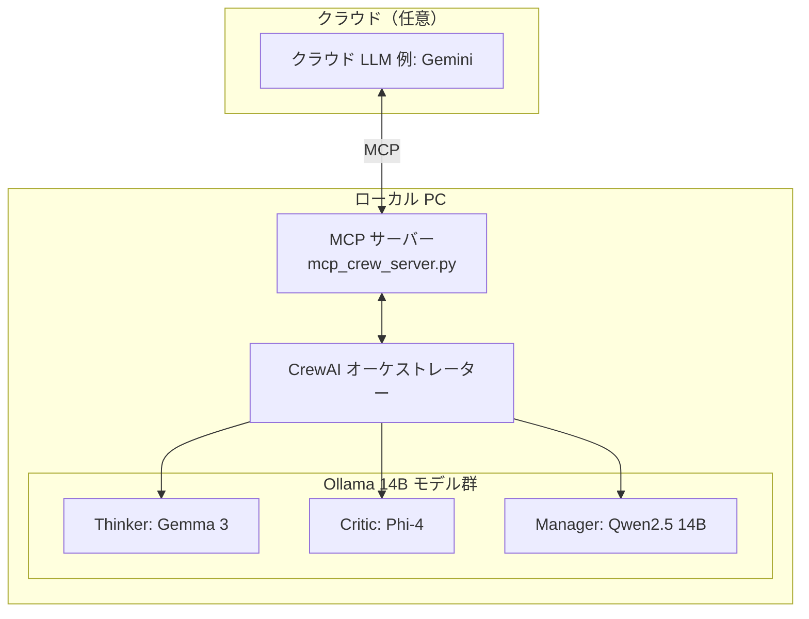

# HERA: Hybrid Edge-cloud Resource Allocation


> [English version here](README.md)

[CrewAI](https://github.com/crewAIInc/crewAI) と [Ollama](https://ollama.com/) をベースにした、ローカルファーストなマルチエージェント AI システムです。
14B クラスのモデルを自分の GPU 上で完全実行でき、クラウド API は不要。
必要なときだけ `.env` 一行で Gemini などのクラウド LLM に切り替えられます。

---

## なぜ HERA なのか

一般的な AI ワークフローはあらゆる処理をクラウド API に依存します。HERA はその前提を逆転させます。

- **Thinker**（Gemma 3）— タスクを分解し、初稿をローカルで作成
- **Critic**（Phi-4）— 出力をレビューしてハルシネーションをローカルで検出
- **Manager**（Qwen2.5 14B）— 全体を統括し、本当に必要な場面だけクラウドに委譲

高価なクラウドトークンを「それが必要な処理」だけに使う設計です。

| 課題 | HERA の答え |
|---|---|
| API コスト | 試行錯誤はすべてローカルで完結 |
| プライバシー | ドラフト段階のデータは外部に出ない |
| 品質 | 3 エージェントによる相互レビュー |
| 柔軟性 | `.env` 一行でモデルを差し替え可能 |

---

## 主な特徴

- **HERA リソース戦略** — タスクの性質に応じてローカル／クラウドを動的に使い分け
- **MCP サーバーモード** — Claude Desktop や Cursor などのクライアントにクルーをツールとして提供
- **集中 LLM 設定** — `llms.yaml` 一ファイルで全モデルを管理、`.env` で実行時上書き可能
- **32k コンテキスト** — 全 Ollama 呼び出しに `num_ctx: 32768` を適用済み
- **OpenAI 依存ゼロ** — デフォルトで完全オフライン動作、`OPENAI_API_KEY` 不要

---

## システムアーキテクチャ



詳細は [ARCHITECTURE.md](ARCHITECTURE.md) を参照してください。

---

## ディレクトリ構成

```text
hera-crew/
├── .env.example                # 環境変数テンプレート
├── mcp_settings_example.json   # MCP クライアント設定例
├── mcp_crew_server.py          # MCP サーバー エントリーポイント
├── requirements.txt
├── scripts/
│   └── inspect_llm.py
├── tests/
│   ├── test_delegation.py
│   └── test_llm_syntax.py
└── src/hera_crew/
    ├── config/
    │   ├── agents.yaml         # エージェント役割定義
    │   ├── llms.yaml           # LLM モデル集中管理
    │   └── tasks.yaml          # タスクルーティング定義
    ├── tools/
    │   └── antigravity_delegate.py
    ├── crew.py
    └── main.py
```

---

## 動作要件

- Python 3.10 〜 3.13
- [Ollama](https://ollama.com/) がインストール済みで起動していること
- GPU 推奨（14B モデルを同時実行する場合は VRAM 16 GB 以上を推奨）

---

## セットアップ

```bash
git clone https://github.com/ryohryp/hera-crew.git
cd hera-crew

python -m venv venv
source venv/bin/activate        # Windows: venv\Scripts\activate

pip install -r requirements.txt

cp .env.example .env
# 必要に応じて .env を編集
```

必要な Ollama モデルをプル：

```bash
# HERA クルー用（main.py）
ollama pull qwen2.5:14b         # Manager — function calling 対応必須
ollama pull gemma3:latest       # Thinker
ollama pull phi4:latest         # Critic

# MCP サーバー用（mcp_crew_server.py）
ollama pull qwen2.5-coder:14b   # Specialist / Coder
ollama pull deepseek-r1:14b     # Reviewer
```

---

## 実行方法

### スタンドアロン CLI

```bash
python src/hera_crew/main.py
```

プロンプトにタスクを入力するだけです。クルーが順番に動作します：
Thinker → Critic → Manager → 最終出力

### MCP サーバー

```bash
python mcp_crew_server.py
```

MCP クライアントの設定ファイル（例: Claude Desktop の `claude_desktop_config.json`）に追加：

```json
{
  "mcpServers": {
    "hera-crew": {
      "command": "絶対パス/venv/Scripts/python",
      "args": ["絶対パス/mcp_crew_server.py"]
    }
  }
}
```

`delegate_task(task_description)` ツールが使えるようになり、複雑なタスクをローカルのエージェントチームにオフロードできます。

### クイックテスト

```bash
python tests/test_delegation.py
```

---

## 設定のカスタマイズ

### `llms.yaml` でモデルを変更

```yaml
hera:
  manager:
    model: "ollama/qwen2.5:14b"   # ollama/ プレフィックス必須
    timeout: 300
    num_ctx: 32768
  thinker:
    model: "ollama/gemma3:latest"
  critic:
    model: "ollama/phi4:latest"
```

### `.env` で実行時に上書き

```ini
MANAGER_MODEL=ollama/qwen2.5:14b
THINKER_MODEL=ollama/gemma3:latest
CRITIC_MODEL=ollama/phi4:latest

# クラウドモデルへ切り替える場合:
# MANAGER_MODEL=gemini/gemini-1.5-pro
# GOOGLE_API_KEY=your_key
```

> **注意:** Ollama モデルには必ず `ollama/` プレフィックスを付けてください。省略すると LiteLLM が OpenAI にルーティングして認証エラーまたは接続エラーになります。
> **注意:** Manager には function calling 対応モデルを指定してください（Ollama 上の `deepseek-r1` はツール呼び出し非対応です。`qwen2.5` などを推奨します）。

### トラブルシューティング

**`Failed to connect to OpenAI API` (Connection error) が出る**
LiteLLM がモデル情報の確認などのために OpenAI に接続しようとして失敗しています。`.env` に以下の 3 つが設定されているか確認してください：
- `OPENAI_API_KEY=NA`
- `LITELLM_LOCAL_MODEL_COST_MAP=True`
- `LITELLM_DROP_PARAMS=True`

**`invalid_api_key` エラーが出る**
`.env` に `OPENAI_API_KEY=NA` が設定されているか確認してください。本プロジェクトのテンプレートでは設定済みです。

**`404 Model Not Found` エラーが出る**
`.env` や `llms.yaml` で指定したモデル名が、`ollama list` で表示される名前と一致しているか確認してください。また、`ollama/` プレフィックスが付いていることも必須です。

**長い会話でモデルが「忘れる」**
`llms.yaml` の `num_ctx` を確認してください。デフォルトで `32768` に設定されています。

---

## ライセンス

[MIT](LICENSE)

---

*HERA: Hybrid Edge-cloud Resource Allocation for Autonomous Multi-Agent Development.*
